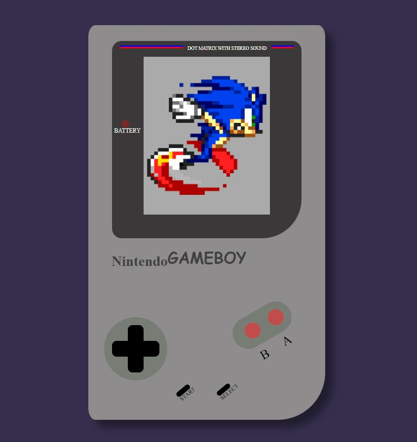

# GameBoy-Classic

Es el primer proyecto que realizo en GeekHubs Academy, consiste en la realización de una consola simple usando html, CSS y un poco de JS.

## Pre-requisitos 📋

Necesitaremos simplemente la instalación de un programa para realizar nuestro código, en este proyecto se ha utilizado Visual Studio Code

## Construido con 🛠️

* [Visual studio code] (https://code.visualstudio.com/Download/) - El IDE utilizado para la realización de este proyecto

## Autores ✒️

* **Cristian Santamaria** - *Realización del proyecto total*

## Foto del proyecto final ✌(◕‿-)✌

 
